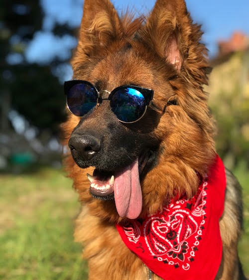

# gaus

A gaussian blur experiment. I wrote this to test how gaussian blur works on images, and whether I could implement it from scratch. It's a toy, not a library.

## How gaussian blur works

Gaussian blur smooths an image by replacing each pixel with a weighted average of the pixels around it. The weights come from a gaussian (bell-curve) distribution: the center pixel contributes the most, and contribution falls off with distance, so it looks like looking through frosted glass rather than smearing.

The key detail is that a 2D gaussian is **separable**: the blur can be done as two 1D passes (horizontal, then vertical) instead of one 2D pass, which cuts the work from O(width × kernel²) to O(width × kernel). That's what the code does. Edges are clamped (replicated) so the border doesn't darken or blur in from nothing.

`GAUS_SIGMA` controls the strength: higher sigma = wider kernel = more blur. The default is 1.5.

## Test images

Original:



Blurred with sigma 1.5:


## Usage

```bash
bun run src/index.ts <image.bmp>
```

Blurs a 24/32-bit uncompressed (BI_RGB) BMP and writes `<image>-blur.bmp` next to it.
